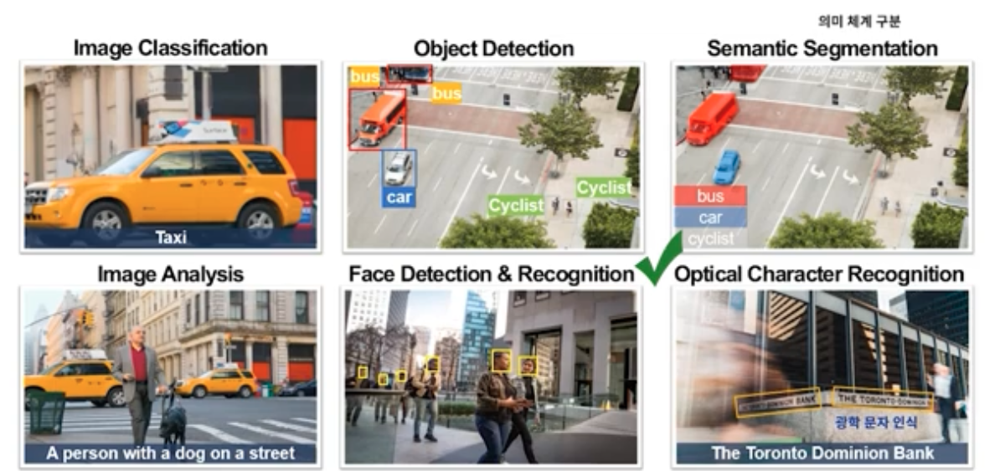

# 2주차

## Machine Learning

과거의 데이터를 이용하여 미래를 예측하는 기술

### 머신러닝 분류

- Regression (회귀)<지도>
- Classification (분류)<지도>
- Clustering (군집)<비지도>

레이블 유무에 따라 지도, 비지도 학습으로 분류

### Regression

가격, 개수 등 예측

데이터를 `Training`할 부분, `Validation`할 부분으로 쪼갬.  
`Training`으로 학습시키고, `Validation`으로 검증함.

### Classification

여러 요인 -> 등급

Confidence Metrics (혼동 행렬)

### Clustering

데이터를 이용하여 그룹으로 나눔.

K-means Clustering

---

## Computer Vision

### 종류

- Image Classification
- Object Detection
- Semantic Segmentation: Pixel로 Object에 색을 칠함.
- Image Analysis: 사진에 대하여 설명을 해줌.
- Face Detection & Recognition: 얼굴 인식에 특화.
- Optical Character Recognition(OCR): 광학 문자 인식.

### Microsoft의 Computer Vision 서비스

- Computer Vision
- Custom Vision: 나만의 데이터를 가지고 학습 (Image Classification/Object Detection)
- Face
- Form Recognizer
