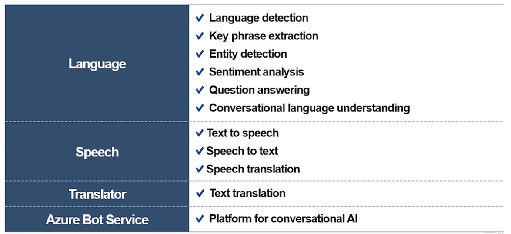

# 3주차

## NLP - 자연어 처리

- Text analysis and entity recognition (텍스트 분석 및 엔티티 인식)
- Sentiment analysis (감정 분석)
- Speech recognition and synthesis (음성인식 합성)
- Machine translation (기계 번역)
- Semantic language modeling (의미 체계적 언어 모델링)

### Microsoft가 제공하는 NLP 서비스

### Azure's Service

- Azure Machine Learning
- Cognitive Services (like 딥러닝)
- Azure Bot Service (챗봇)
- Azure Cognitive Search (지능형 검색)
