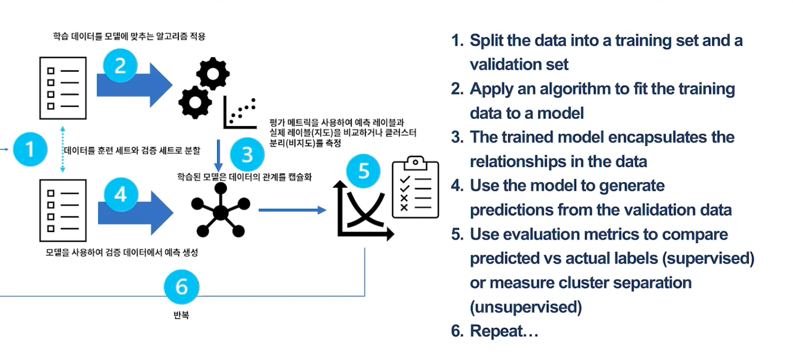

# 4주차 - 머신 러닝

## 머신 러닝

> 데이터에서 관계를 찾아 예측 모델을 만드는 기술

`Feature`와 `Label` 데이터의 관계를 이용해서 예측 모델을 만드는 것.

머신 러닝은 지도 학습과 비지도 학습으로 나눌 수 있음.

### 머신 러닝의 분류

- 지도 학습: `Feature`와 `Label`을 함께 사용해서 학습하는 기법: Regression, Classification
- 비지도 학습: Label 없이 학습할 수 있게 하는 기법: Clustering

### 머신 러닝의 종류

- Regression: 어떠한 값을 예측하는 문제 (나이 등 연속적인 값)
- Classification: 몇 가지 카테고리로 나누는 문제
- Clustering: 유사한 특징인 것을 그룹화하는 문제

## Regression 회귀 (값의 예측, 수의 예측)

Training 부분과 Validation 부분으로 나누고, Training 부분을 이용하여 모델을 학습시킴.  
-> linear regression

Validation 부분을 이용하여 모델이 올바르게 학습되었는지 확인함. 손실이 최소화되는 방향으로 모델을 조정

### 회귀용 평가 매트릭

- coefficient of determination (결정 계수, R 제곱): 모델의 예측력
- MAE (절대 손실): 오차의 절대값의 평균
- MSE (제곱 손실): 오차의 제곱값의 평균
- RMSE: 오차의: MSE값에 루트를 씌운 값

## Classification (여러 특징 -> 분류)

Regression과 마찬가리고 Training 부분과 Validation 부분으로 나누고, Training 부분을 이용하여 모델을 학습시킴.

`Sigmoid function` or `Logistic Regression function`을 이용하여 0에서 1사이의 값으로 변환 시킬 수 있음.

### 성능 평가는 어떻게 할까?

Regression과 마찬가지로 Validation 부분 데이터를 이용하여 평가함.

정확도: 전체의 개수중 `TruePositive` + `TrueNegative`
-> 모델이 맞춘 개수

## Clustering (군집, 그룹)

- 카테고리, 유형 등 나눌 때 사용
- 정답 데이터를 갖지 않음.
- 제공된 데이터를 학습하여 그룹으로 나눔.

## Model Training and Validation

## Azure

### Azure Machine Learning?

Azure ML Workspace에서는 머신러닝을 위한 여러가지 기능들을 제공한다.

데이터와 원하는 감독 모델 유형을 제공하고 Azure Machine Learning이 최상의 모델을 찾음.

### Azure Machine Learning Designer

머신 러닝 학습 및 평가 과정을 Visual Tool을 이용하여 쉽게 할 수 있음.
